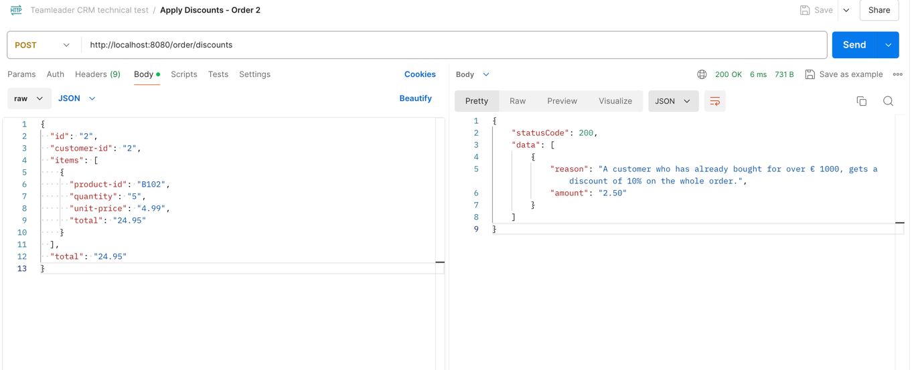
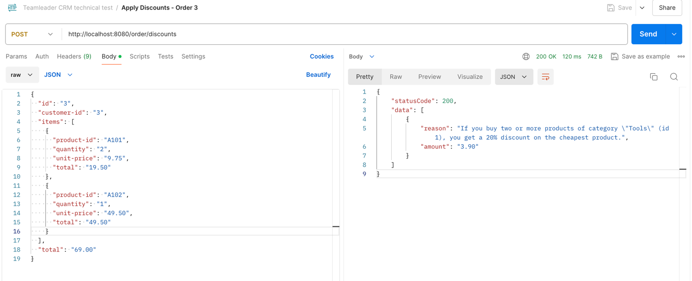

# TeamleaderCRM Coding Test: Problem 1 - Discounts

Hello! :wave:

The coding test has been completed using [SlimPHP Skeleton](https://github.com/slimphp/Slim-Skeleton) and following DDD principles.

## Task

The task description can be found [here](https://github.com/teamleadercrm/coding-test/blob/master/1-discounts.md).

## Installation

1. Clone the repository to your local machine.
2. Go to the project directory.
3. Run `composer install` to install the dependencies.

## Usage

1. Run `composer start` to start the server.

Exists multiple ways to test the application but the most common are:

### [Postman](https://www.postman.com/)
- Import the collection from the `postman` directory.
- Run the requests in the collection.
- The collection contains the following requests:
    - `POST /order/discounts`
  



 
### cURL
Run the following commands to see the examples:
  - [Order 1](https://github.com/teamleadercrm/coding-test/blob/master/example-orders/order1.json):
      ```bash
    curl -X POST "http://localhost:8080/order/discounts" -H "Content-Type: application/json" -d '{"id": "1", "customer-id": "1", "items": [{"product-id": "B102", "quantity": "10", "unit-price": "4.99", "total": "49.90"}], "total": "49.90"}'
      ```

  - [Order 2](https://github.com/teamleadercrm/coding-test/blob/master/example-orders/order2.json)
    ```bash
    curl -X POST "http://localhost:8080/order/discounts" -H "Content-Type: application/json" -d '{"id": "2", "customer-id": "2", "items": [{"product-id": "B102", "quantity": "5", "unit-price": "4.99", "total": "24.95"}], "total": "24.95"}'
    ```
  - [Order 3](https://github.com/teamleadercrm/coding-test/blob/master/example-orders/order3.json)
    ```bash
    curl -X POST "http://localhost:8080/order/discounts" -H "Content-Type: application/json" -d '{"id": "3", "customer-id": "3", "items": [{"product-id": "A101", "quantity": "2", "unit-price": "9.75", "total": "19.50"}, {"product-id": "A102", "quantity": "1", "unit-price": "49.50", "total": "49.50"}], "total": "69.00"}'
    ```

## API Documentation

### `POST /order/discounts`

Apply discounts to an order. The request body should be in JSON format and include the following fields:

- `id`: The order ID
- `customer-id`: The customer ID
- `items`: An array of items, each with the following fields:
    - `product-id`: The product ID
    - `quantity`: The quantity of the product
    - `unit-price`: The unit price of the product
    - `total`: The total price for the item
- `total`: The total price for the order
    
## Tests

Run `composer test` to run the tests.